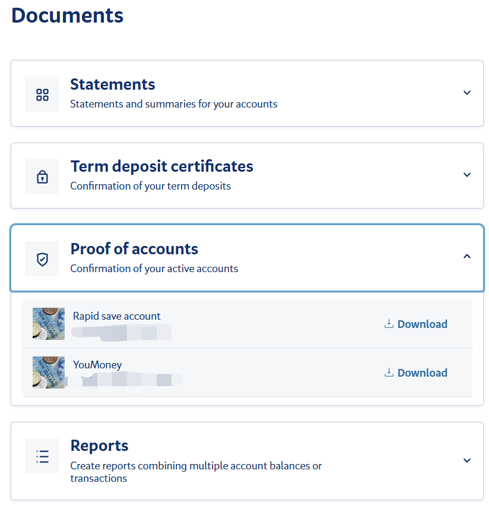
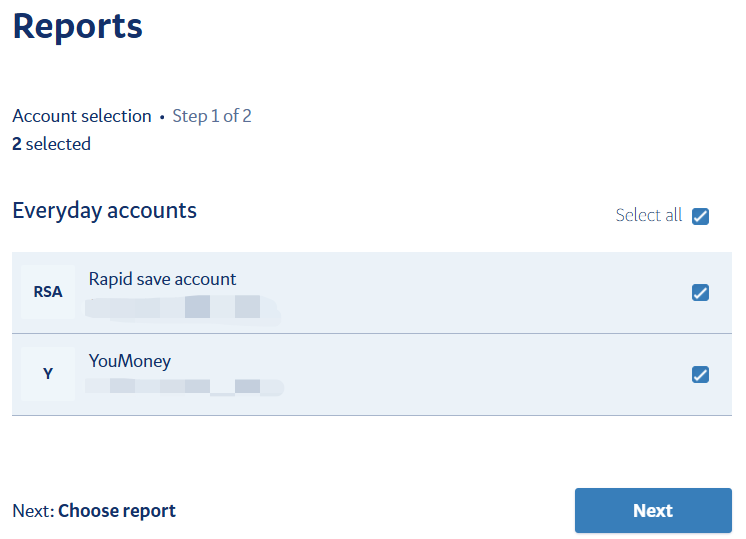
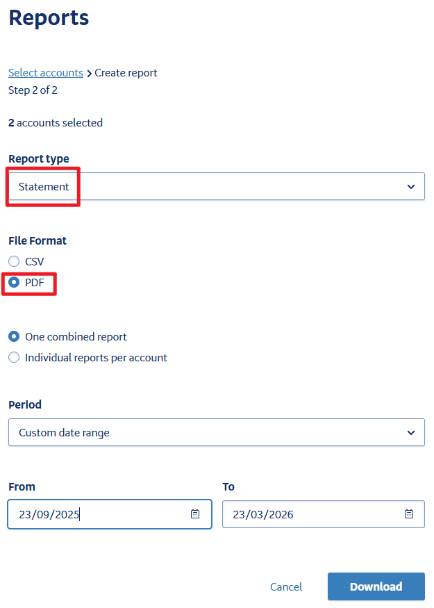

# BNZ 电子银行流水

在新西兰，BNZ 银行客户可通过 [BNZ 官网](https://www.bnz.co.nz/) 或 **BNZ** App 获取电子银行流水，用于申请签证、租房等场景。

::: info
BNZ 网上银行和 App 中的 **Document** 区域可下载各类证明。
:::

## 办理渠道

- **BNZ Internet Banking**：电脑端登录 [bnz.co.nz](https://www.bnz.co.nz/)
- **BNZ**：手机 App

## 获取步骤

### 1. 登录 BNZ Internet Banking

使用你的 BNZ 的 Access Number (可在注册 BNZ 账户接受的邮件中找到) 和密码登录，可能需要手机的 BNZ App 验证登陆。

### 2. 登陆并找到 Document 菜单

登录后默认进入账户概览页，可看到所有当前账户和储蓄账户。点击左上角的折叠菜单，进入 "Document" 菜单。

### 3. 下载 Proof

首先选择**「Proof of accounts」**下载所需账户的证明。

::: tip
注：因为 BNZ 的 Statement 只显示账户不显示姓名，所以需要结合 Proof。
:::

### 4. 下载 Statement

在 Document 页面，选择 "Reports" 选项，点击 "Create" 依次进行下一步。

选择需要生成流水的账户。

选择 Report type 为 Statement，File Format 选择为 PDF，日期范围根据需求设定即可下载。

## 注意事项

- 电子流水建议保存为 PDF，如用于签证申请需要提交 PDF 格式文档；
- 建议使用 PDF 编辑工具（如 Acrobat）将 Proof 和 Statement 整合到一个文档中。

------

*最后编辑：2026-03-25      作者: [wrx012](https://github.com/wrx012)* 
