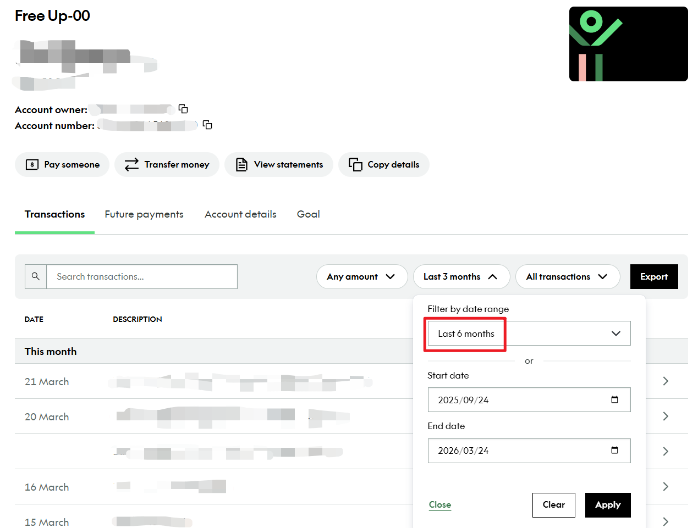

# Kiwibank 电子银行流水

在新西兰，Kiwibank 银行客户可通过 [Kiwibank 官网](https://www.kiwibank.co.nz/personal-banking/) 获取电子银行流水，用于申请签证、租房等场景。

## 办理渠道

- **Kiwibank Internet Banking**：电脑端登录 [kiwibank.co.nz](https://www.kiwibank.co.nz/personal-banking/)

## 获取步骤

### 1. 登陆并找到 Document 菜单

使用你的 Kiwibank 的 Access Number 和密码登录，登录后进入需要生成流水的账户，如下图，点击 View statements 进入下导出页面。

### 2. 下载 Statement

下载所需季度的 Statement。

::: tip
注：因为 Kiwibank 的 Statement 只能按照每个完整季度导出，需要指定日期内的流水按照下面的方式导出 Transaction。
:::

### 3. 下载 Transaction

在账户页面，直接在搜索框的行中选定指定日期即可导出 Transaction。

选择导出格式。

选择 Report type 为 Statement，File Format 选择为 PDF，日期范围根据需求设定即可下载。

## 注意事项

- 电子流水建议保存为 PDF，如用于签证申请需要提交 PDF 格式文档；

------

*最后编辑：2026-03-25      作者: [wrx012](https://github.com/wrx012)* 
